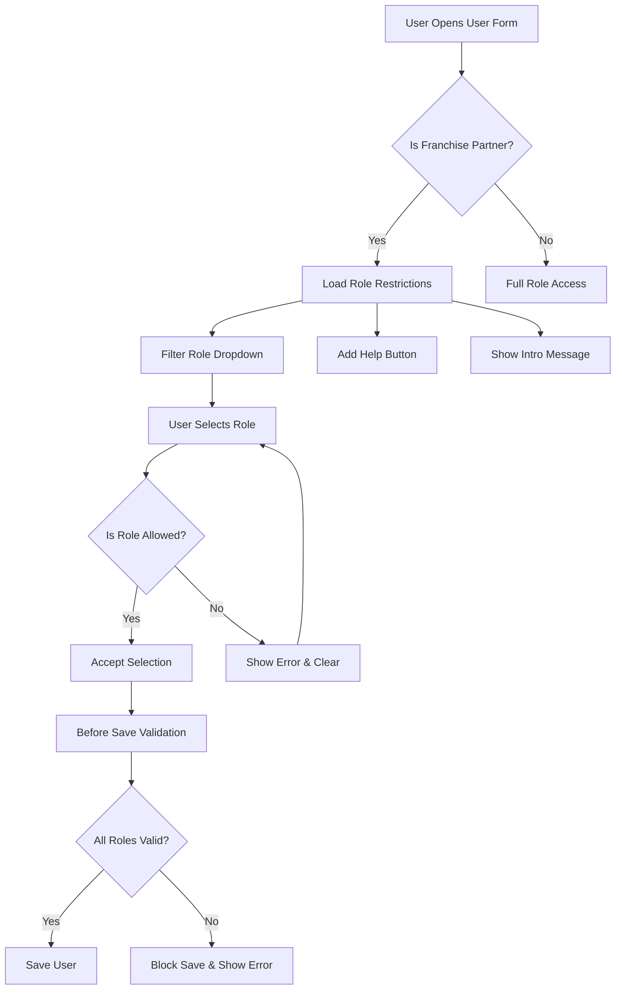

# Franchise Partner Role Assignment Restrictions

## Overview

This implementation provides a secure and controlled way for Franchise Partners to manage user roles within their companies. It restricts Franchise Partners to only assign specific roles while maintaining full access for System Managers and other authorized users.

## Features

- ✅ **Role Restriction**: Franchise Partners can only assign 5 specific roles
- ✅ **Server-Side Security**: Validation occurs on both client and server sides
- ✅ **Visual Feedback**: Clear UI indicators and help messages
- ✅ **Real-Time Validation**: Immediate feedback when selecting unauthorized roles
- ✅ **Comprehensive Logging**: Console logging for troubleshooting

## Allowed Roles for Franchise Partners

Franchise Partners can only assign the following roles to users:

1. **Accounts** - Financial and accounting access
2. **Assets** - Asset management capabilities
3. **Attendance** - Employee attendance tracking
4. **HR** - Human resources functions
5. **Stock** - Inventory and stock management

## Implementation Details

### 1. Server-Side Components

#### File: `franchise_portal/franchise_portal/franchise_management.py`

**Functions:**
- `get_assignable_roles()`: Returns list of roles based on user permissions
- `get_franchise_assignable_roles_query()`: Provides query filters for role dropdown

**Security Features:**
- Server-side role validation
- Different behavior for Franchise Partners vs other users
- Whitelisted functions for secure client-server communication

### 2. Client-Side Components

#### File: `franchise_portal/public/js/user_role_restrictions.js`

**Features:**
- **Dropdown Filtering**: Only shows allowed roles in selection
- **Real-Time Validation**: Validates role selection as user types
- **Visual Indicators**: Help buttons and intro text for guidance
- **Pre-Save Validation**: Final check before form submission
- **Error Messaging**: Clear feedback for unauthorized actions

### 3. Configuration

#### Updated in `hooks.py`:
```python
# Whitelisted Methods
whitelisted_methods = [
    "franchise_portal.franchise_portal.franchise_management.get_assignable_roles",
    "franchise_portal.franchise_portal.franchise_management.get_franchise_assignable_roles_query"
]

# DocType JavaScript
doctype_js = {
    "Franchise Signup Application": "public/js/franchise_signup_application.js",
    "User": "public/js/user_role_restrictions.js"
}
```

## How It Works

### 1. User Access Flow



### 2. Technical Flow

1. **Form Load**: Check if user has "Franchise Partner" role
2. **Query Setup**: Apply role filter to dropdown using server function
3. **Real-Time Validation**: Validate each role selection immediately
4. **Visual Feedback**: Show help buttons and restriction notices
5. **Pre-Save Check**: Final validation before document save
6. **Error Handling**: Clear error messages and guidance

### 3. Security Layers

1. **Client-Side Filtering**: UI only shows allowed roles
2. **Real-Time Validation**: Immediate feedback on invalid selections
3. **Pre-Save Validation**: Final check before submission
4. **Server-Side Validation**: Backend verification of role assignments

## User Experience

### For Franchise Partners

1. **Visual Indicators**:
   - Blue intro message explaining restrictions
   - Help button with detailed role information
   - Restricted dropdown options

2. **Error Handling**:
   - Clear error messages for unauthorized roles
   - Automatic clearing of invalid selections
   - Prevention of form submission with unauthorized roles

3. **Help & Guidance**:
   - Contextual help messages
   - List of allowed roles
   - Contact information for additional access

### For System Managers

- **No Impact**: Full access to all roles remains unchanged
- **Override Capability**: Can assign any role without restrictions
- **Administrative Control**: Can manage Franchise Partner permissions

## Testing & Verification

### 1. Test as Franchise Partner

```javascript
// Check restriction status
window.check_franchise_role_restrictions()
// Expected: { allowed_roles: ['Accounts', 'Assets', 'Attendance', 'HR', 'Stock'], is_restricted: true }
```

### 2. Test Role Assignment

1. Login as user with "Franchise Partner" role
2. Navigate to User form
3. Try to add roles - only allowed roles should be visible
4. Attempt to assign unauthorized role - should be blocked

### 3. Verify Server Functions

```python
# In Frappe console
import frappe
from franchise_portal.franchise_portal.franchise_management import get_assignable_roles

# Test with Franchise Partner role
frappe.set_user("franchise_partner_user@example.com")
result = get_assignable_roles()
print(result)  # Should show only 5 allowed roles
```

## Installation & Deployment

### Prerequisites
- Franchise Portal app installed
- "Franchise Partner" role exists in the system
- Users assigned to Franchise Partner role

### Deployment Steps

1. **Files are already created** in the franchise portal app
2. **Build and deploy**:
   ```bash
   cd frappe-bench
   bench build --app franchise_portal
   bench --site [site-name] migrate
   bench restart
   ```

3. **Verify deployment**:
   - Check that JavaScript loads on User forms
   - Test role restrictions with Franchise Partner user
   - Verify server functions are accessible

### Migration Notes

- No database changes required
- Existing users and roles remain unchanged
- Restrictions apply immediately upon deployment

## Troubleshooting

### Common Issues

1. **JavaScript not loading**:
   - Check `hooks.py` configuration
   - Verify file paths are correct
   - Run `bench build --app franchise_portal`

2. **Server functions not accessible**:
   - Verify `whitelisted_methods` in hooks.py
   - Check function paths are correct
   - Restart bench after changes

3. **Restrictions not working**:
   - Verify user has "Franchise Partner" role
   - Check browser console for errors
   - Test server functions in Frappe console

### Debug Commands

```bash
# Build assets
bench build --app franchise_portal

# Check JavaScript includes
bench console
>>> frappe.get_hooks("doctype_js")

# Test server functions
>>> frappe.call("franchise_portal.franchise_portal.franchise_management.get_assignable_roles")
```

## Customization

### Adding New Allowed Roles

1. **Update server function** in `franchise_management.py`:
   ```python
   return [
       "Accounts",
       "Assets", 
       "Attendance",
       "HR",
       "Stock",
       "New Role Name"  # Add here
   ]
   ```

2. **Update client validation** in `user_role_restrictions.js`:
   ```javascript
   const allowed_roles = ['Accounts', 'Assets', 'Attendance', 'HR', 'Stock', 'New Role Name'];
   ```

3. **Rebuild and deploy**:
   ```bash
   bench build --app franchise_portal
   bench restart
   ```

### Modifying Restriction Logic

The restriction logic can be customized by modifying the server-side functions to:
- Check different user roles
- Apply time-based restrictions
- Include company-specific limitations
- Add approval workflows

## Security Considerations

1. **Server-Side Validation**: Never rely only on client-side restrictions
2. **Role Verification**: Always verify user roles on server side
3. **Audit Trail**: Consider logging role assignment actions
4. **Regular Review**: Periodically review and update allowed roles

## Support

For technical support or customization requests:
- **Email**: admin@nexcharventures.com
- **Documentation**: See franchise portal app documentation
- **Issues**: Report in franchise portal repository

---

**Version**: 1.0  
**Last Updated**: December 2024  
**Compatible With**: Frappe v14+, ERPNext v14+ 